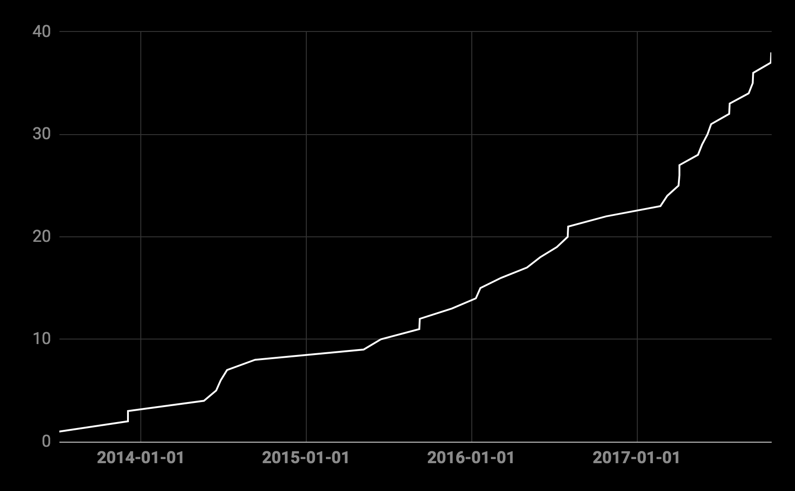
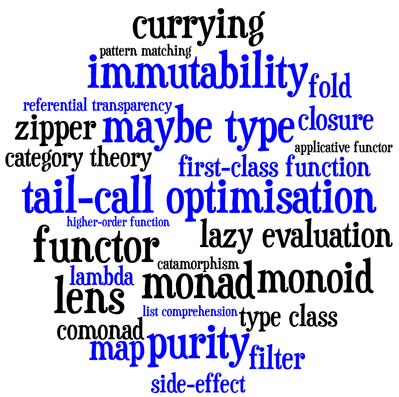

## Scala no mundo real

---
@title[Perfil: Leonardo]
### Quem é o Leonardo
- 99ner
- Programador Scala há 1 ano +-
- Antes disso Python, Java, .Net ...
- github/leofigs
- leofigs no gmail
- @leonardofigs no Twitter
---

@title[Scala]

## Scala


Multi paradigma ( Funcional + OO )
Bitecode Java - JVM


---
@title[99 scala evolution]
### Repositórios Scala na 99




---
@title[99 scala repos]
### Scala em 2017


Note:
- Ativos = criados ou modificados em 2017
- Empresa poliglota
- Scala é uma das linguagens principais
- Scala é utilizada desde 2013

---
@title[99 scala languages]

### Outras linguagens na 99


---
@title[Funcional]


## Scala é Funcional


---
@title[Functional Concepts]

## Paradigma funcional





---
@title[Funcional - Imutabilidade]

### Imutabilidade


- Isolamento
- Menos side effects (e bugs)
- Mais facil para paralelizar
- Melhoria na concorrência
- Mais fácil para cachear / serializar

```
println(List(1,2,3).getClass)
//class scala.collection.immutable.$colon$colon
```

---
@title[Funcional - Monads]

### Monads


Em duas palavras: Encapsula computação.
( existem mais regras para monads...)

Future é uma monad:
```scala
val f = Future {
	println("o futuro é agora")
}
```

---
@title[Functional - Code example]

### Código menos e mais sucinto

Java:
```java
public static Optional<Long> s2SourceFromLatLng(Double lat, Double lng, int estimativeCellLevel) {
  try {
    return Optional.of(S2CellId.fromLatLng(S2LatLng.fromDegrees(lat, lng)).parent(estimativeCellLevel).id());
  } catch (Exception e) {
    return Optional.empty();
  }
}
```

Scala:
```scala
def getCell(lat: Double, lng: Double, estimativeCellLevel: Integer = 18) =
    Try(S2CellId.fromLatLng(S2LatLng.fromDegrees(lat, lng)).parent(estimativeCellLevel).id).toEither
```


---
@title[Functional - Libraries]

### Bibliotecas Funcionais

Scala não define classes básicas para estruturas funcionais.


Bibliotecas:

 Scalaz

Cats 


---
@title[WWW]


### Scala para a Web


---
@title[ScalaJS]


---
@title[WWW - Scalatra]


---
@title[WWW - Play]


---
@title[WWW - Akka HTTP]


---

@title[Reactive title]


---
@title[Reactive]


---
@title[Data]


---
@title[Data - BigData]


---
@title[Data - LittleData]


---
@title[Market]


---
@title[Market - Stackoverflow dev survey]


---
@title[Market - Brazil]


---
@title[Market - World]


---
@title[Bibliografia / Sources]

### Fontes:

- None yet


---
@title[The End]

## Obrigado.

## Estamos contratando


**The End**
---
