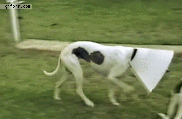
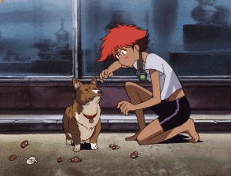

## Scala no mundo real

---
@title[Perfil: Leonardo]

### Quem é o Leonardo

- 99ner
- Programador Scala há 1 ano +-
- Antes disso Python, Java, .Net ...
- dog person

@fa[github] leofigs   |   @fa[twitter] @leonardofigs   |   @fa[envelope-o] leofigs no gmail

---
@title[Scala]


- Multi paradigma ( Funcional + OO ) |
- Bitecode Java / JVM |
- Lightbend |


---
@title[99 scala evolution]
### Repositórios Scala na 99


---
@title[99 scala repos]
### Repositórios Scala ativos em 2017


Note:
- Ativos = criados ou modificados em 2017
- Empresa poliglota
- Scala é uma das linguagens principais
- Scala é utilizada desde 2013

---
@title[99 scala languages]

### Outras linguagens na 99


---
@title[Funcional]


## Scala é Funcional


---
@title[Functional Concepts]

## Paradigma funcional


---
@title[Funcional - Imutabilidade]

### Imutabilidade



- Menos side effects (e bugs) |
- Mais facil para paralelizar |
- Melhoria na concorrência |
- Mais fácil para cachear / serializar |

---
@title[Funcional - Imutabilidade]

### O default em Scala é sempre imutável

```
println(List(1,2,3).getClass)
//class scala.collection.immutable.$colon$colon
```
---
@title[Funcional - Var]


### E o var?




---
@title[Funcional - Monads]

### Monads


Em duas palavras: Encapsula computação.
( existem mais regras para monads...)

Future é uma monad:
```scala
val f = Future {
	println("o futuro é agora")
}
```

---
@title[Functional - Code example]
### Código menor e mais sucinto

Java:
```java
public static Optional<Long> s2SourceFromLatLng(
	Double lat, Double lng, int estimativeCellLevel) {
  try {
    return Optional.of(S2CellId.fromLatLng(
      S2LatLng.fromDegrees(lat, lng)).parent(
        estimativeCellLevel).id());
  } catch (Exception e) {
    return Optional.empty();
  }
}
```

Scala:
```scala
def getCell(lat: Double, lng: Double,
	estimativeCellLevel: Integer = 18) =
    Try(S2CellId.fromLatLng(S2LatLng.fromDegrees(lat, lng))
      .parent(estimativeCellLevel).id).toEither
```


---
@title[Functional - Libraries]

### Bibliotecas Funcionais

Scala não define classes básicas para estruturas funcionais.


Bibliotecas:

 Scalaz


---
@title[WWW]


### Scala para a Web


---
@title[ScalaJS]


- Tipagem estática
- Compila o código para Javascript (+ performance)
- Interoperavel com React, AngularJS
- Typescript++

---
@title[ScalaJS - Example]

```javascript
class Person(val firstName: String, val lastName: String) {
  def fullName(): String =
    s"$firstName $lastName"
}
```


```javascript
val names = persons.map(_.firstName)
```
---
@title[WWW - Play]


- Akka no motor
- Stateless
- RESTful
- Big players ( Linkedin, Samsung, Walmart, theguardian)

---
@title[WWW - Play - Example]

### Endpoint Play

```scala
def findAllReceiptsByRefund(refundId: Long,
  limit: Int, offset: Int) = Action.async { request =>
    val res = for {
      recs  <- receipts.findByRefund(Some(refundId), limit: Int, offset: Int)
      count <- receipts.countFindByRefund(Some(refundId))
      jsonResult = Json.obj("receipts" -> recs, "size" -> count)
    } yield jsonResult
    res map (Ok(_))
  }
```

---
@title[WWW - Akka HTTP]


AKKA-HTTP não é um framework web.


---
@title[WWW - Akka HTTP]

É um "toolkit" server e client http contruída sob o akka-actor e akka-stream


---
@title[WWW - Akka HTTP]

### Comofas


```scala
object GeocoderResource extends BaseResource {
  val routes = pathPrefix("geocode" / "city") {
    pathEndOrSingleSlash {
      get {
        parameters('lat.as[Double], 'long.as[Double]){ (lat, long) =>
            getCityByLatLong(lat, long)
        }
      }
    }
  }

  def getCityByLatLong(lat: Double, long: Double) = complete(OK)
}
```


---
@title[Reactive title]

### Scala é Reativo


---
@title[Reactive]


Plataforma Reativa


---
@title[Data]

### Data em Scala


---
@title[Data - BigData]

### BigData


---
@title[Market]

### Mercado de trabalho


---
@title[Market - Stackoverflow dev survey]


StackOverflow Developer Survey

- Linguagem mais bem paga nos EUA em 2016 e 2017 |
- Top 10 mais bem pagas no mundo |
- Top 10 média salarial |

---
@title[Market - Brazil]

### Mercado no Brasil


---
@title[Market - World]

### Mercado no mundo


---
@title[The End]

## Obrigado.

## Estamos contratando


**The End**
---
